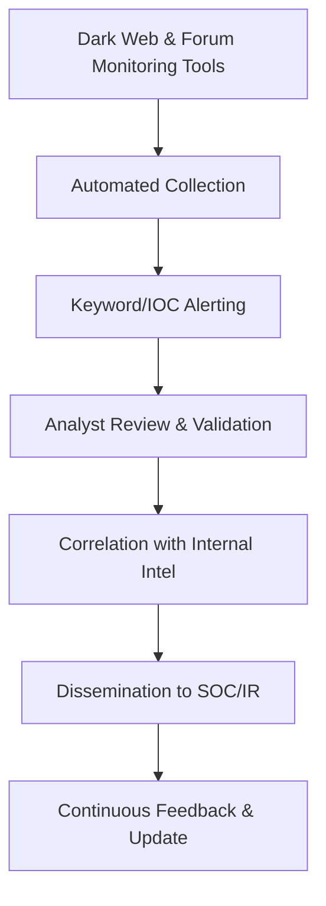

# Levels of Threat Intelligence

Threat Intelligence is categorized into three levels based on its purpose, audience, and technical depth: **Strategic**, **Operational**, and **Tactical**.

---

## 1. Strategic Threat Intelligence

**Purpose**: High-level decision-making based on long-term threat trends.  
**Audience**: Executives, CISOs, policymakers.  
**Focus**: Threat actor intent, geopolitical motives, industry risks.

**Characteristics**:
- Non-technical, narrative style
- Derived from open-source, geopolitical, and industry reporting
- Helps shape security strategies and investment

**Examples**:
- Analysis of APT groups targeting energy sectors in Southeast Asia.
- Reports on the impact of AI in phishing and misinformation campaigns.
- Trends showing shift from ransomware encryption to pure extortion.

---

## 2. Operational Threat Intelligence

**Purpose**: Supports planning and coordination of threat detection and incident response.  
**Audience**: Threat Intelligence teams, IR teams, SOC leads.  
**Focus**: Campaigns, attack infrastructure, TTPs (Tactics, Techniques, and Procedures).

**Characteristics**:
- Semi-technical
- Links threats to known adversaries and recent campaigns
- Enables proactive defense posture

**Examples**:
- Report on Scattered Spider’s SIM-swapping + Okta targeting tactics.
- Infrastructure breakdown of LockBit 3.0 affiliates.
- Campaign data using Google Drive links for malware delivery.

---

## 3. Tactical Threat Intelligence

**Purpose**: Provides immediate, actionable data for SOC/EDR/SIEM operations.  
**Audience**: SOC analysts, detection engineers, threat hunters.  
**Focus**: IOCs (Indicators of Compromise), signatures, hashes, domains, rules.

**Characteristics**:
- Highly technical
- Time-sensitive, fast-aging
- Directly feeds into security tooling

**Examples**:
- IP addresses associated with Cobalt Strike C2 servers.
- File hash of malware loader used in recent QakBot attacks.
- YARA rule detecting Excel macro-based infostealers.

---

## Summary Table

| Level       | Focus Area              | Audience            | Output Format                      | Example                              |
|-------------|-------------------------|----------------------|------------------------------------|--------------------------------------|
| Strategic   | Big picture, trends     | Executives, CISOs    | Reports, presentations             | Nation-state targeting forecasts     |
| Operational | Campaigns, TTPs         | IR Teams, TI Teams   | Threat actor profiles, alerts      | Scattered Spider’s social engineering |
| Tactical    | IOCs, malware signatures| SOC Analysts         | Feeds, rules, correlation queries  | Malicious IPs from C2 infrastructure |

---

> Use all three levels in tandem for a mature and responsive cyber threat intelligence program.
--------------------------------------------------------------------------------------------------------------------------------------------

# 🔍 Differentiating Threat Actors, TTPs, IOCs, and IOAs

A structured comparison of four foundational cyber threat intelligence elements.

---

## 1. 🧠 Threat Actors

**Definition**: Individuals, groups, or entities responsible for malicious cyber activities.

**Key Attributes**:
- **Motivation**: Espionage, financial gain, ideology, revenge
- **Types**:
  - Nation-state (e.g., APT29)
  - Cybercriminals (e.g., FIN7)
  - Hacktivists (e.g., Anonymous)
  - Insider threats

**Example**:  
APT28 (Fancy Bear) is a Russian state-sponsored threat group targeting NATO-related entities using spear-phishing and custom malware.

---

## 2. 🛠️ TTPs – Tactics, Techniques, and Procedures

**Definition**: Describes *how* threat actors operate.

**Structure (MITRE ATT&CK-based)**:
- **Tactic**: Why (goal) – e.g., Initial Access
- **Technique**: How (method) – e.g., Phishing (T1566)
- **Procedure**: Specific implementation – e.g., SMS with fake Okta login link

**Example**:  
- Tactic: Initial Access  
- Technique: Spearphishing via SMS (T1566.001)  
- Procedure: Sending fake Okta login page via SMS to targeted employees

---

## 3. 🧾 IOCs – Indicators of Compromise

**Definition**: Observable forensic data confirming compromise.

**Types**:
- File hashes (MD5, SHA256)
- Malicious IPs and domains
- Registry keys, malware file names

**Purpose**: Reactive detection (e.g., SIEM, EDR, IDS)

**Example**:  
- IP Address: 185.141.63.120  
- File Hash (SHA256): 34d2d90f7f2b3...  
- Domain: secure-login[.]xyz

---

## 4. 🔍 IOAs – Indicators of Attack

**Definition**: Behavioral patterns indicating intent to attack, even without known IOCs.

**Purpose**: Proactive detection based on behavior and sequence of actions.

**Examples**:
- PowerShell execution triggered by a Word document
- Outlook spawning `cmd.exe` followed by system enumeration
- Suspicious access to LSASS memory from unknown process

---

## 🧩 Comparison Table

| Category        | Focus           | Nature     | Purpose                          | Examples                                                  |
|----------------|------------------|------------|----------------------------------|-----------------------------------------------------------|
| **Threat Actor**| WHO              | Identity   | Attribution, profiling           | APT29, Lazarus, FIN7                                       |
| **TTPs**        | HOW              | Behavioral | Detection engineering, emulation | Phishing, LOLBins, lateral movement                        |
| **IOCs**        | WHAT (evidence)  | Static     | Reactive detection                | File hashes, malicious domains, registry keys             |
| **IOAs**        | WHAT (intent)    | Dynamic    | Proactive detection               | Word → PowerShell, LSASS memory access, unusual process trees |

---

## ✅ Summary

- **Threat Actors**: WHO is attacking  
- **TTPs**: HOW they operate  
- **IOCs**: WHAT artifacts prove compromise  
- **IOAs**: WHAT behavior shows attack intent  

All four components work best when combined for layered threat intelligence and defense.

---------------------------------------------------------------------------------------------------------------------------------------------------------

# 🛰️ OSINT Tools for Threat Intelligence Gathering

Open-Source Intelligence (OSINT) tools are critical for gathering external threat data, enriching IOCs, profiling adversaries, and monitoring cyber threat landscapes. Below is a categorized list of high-utility OSINT tools used by CTI analysts.

---

## 🌐 Domain, DNS, and WHOIS Investigation

| Tool             | Use Case                                      |
|------------------|-----------------------------------------------|
| **WhoisXML API / WhoisLookup** | Domain registration and ownership metadata       |
| **SecurityTrails**     | Domain history, DNS data, subdomains             |
| **VirusTotal Passive DNS** | Historical DNS records, resolutions              |
| **ViewDNS.info**       | Multi-function DNS, ASN, reverse tools            |
| **CRT.sh**             | Certificate transparency logs for subdomain discovery |

---

## 🔎 IP and Infrastructure Intelligence

| Tool              | Use Case                                      |
|-------------------|-----------------------------------------------|
| **Shodan**             | Internet-exposed services, banners, and device metadata |
| **Censys**             | Similar to Shodan; enriched with certificate analysis   |
| **Greynoise**          | Internet noise vs targeted attack distinction           |
| **AbuseIPDB**          | Crowdsourced malicious IP reputation tracking           |
| **IPinfo.io / MaxMind**| GeoIP, ASN, and network ownership lookup                |

---

## 🦠 Malware & File Intelligence

| Tool               | Use Case                                      |
|--------------------|-----------------------------------------------|
| **VirusTotal**         | File, URL, domain reputation, sandbox detonation |
| **Hybrid Analysis**    | Deep static/dynamic malware analysis             |
| **Joe Sandbox**        | Advanced malware sandbox with MITRE mapping      |
| **MalShare**           | Community-contributed malware samples             |
| **Any.Run (Community)**| Interactive malware analysis                      |

---

## 👤 Threat Actor Profiling

| Tool              | Use Case                                      |
|-------------------|-----------------------------------------------|
| **Malpedia**          | Malware family + actor attribution            |
| **APTNotes / APTWiki**| Community-collected APT group reports         |
| **MITRE ATT&CK**      | Mapping TTPs to threat groups                 |
| **ThreatFox**         | Real-time malware IOC feeds from abuse.ch    |

---

## 📲 Social Media & Dark Web Monitoring

| Tool               | Use Case                                      |
|--------------------|-----------------------------------------------|
| **IntelX**             | Breach data, dark web content, paste sites      |
| **DeHashed**           | Email, password, and breach search             |
| **Recon-ng**           | Modular recon tool for profiling via social platforms |
| **SpiderFoot HX**      | Automated OSINT + dark web correlation          |

---

## 🛠️ Automation and Aggregation Tools

| Tool              | Use Case                                      |
|-------------------|-----------------------------------------------|
| **TheHarvester**      | Email, domain, and IP OSINT gathering        |
| **Amass**             | Subdomain enumeration and mapping            |
| **OSINT Framework**   | Web-based directory of categorized OSINT tools |
| **OpenCTI**           | Threat intel platform for correlation        |
| **MISP**              | Sharing and managing threat intelligence     |

---

## ⚡ Example Workflow (for IOC enrichment)

1. **Input IOC**: Malicious domain  
2. **Run Tools**:
   - `VirusTotal` – check reputation, relations  
   - `SecurityTrails` – domain history, subdomains  
   - `WhoisXML` – registrar, creation date, email  
   - `Shodan/Censys` – see hosting infrastructure  
3. **Correlate with Threat Actors** using:
   - `MITRE ATT&CK`  
   - `Malpedia`  
   - `ThreatFox`

---

## 🧠 Analyst Tip

- Validate tool results across multiple sources.
- Use APIs + automation for bulk IOC enrichment.
- Leverage MISP or OpenCTI for storing, correlating, and tagging collected intel.

---

> OSINT is only as powerful as the analyst using it—combine tools, context, and critical thinking for actionable intelligence.

------------------------------------------------------------------------------------------------------------------------------------------------------------------------------
# 🎯 How to Collect and Validate Indicators of Compromise (IOCs)

The accuracy and timeliness of IOC collection and validation are critical for threat detection, hunting, and incident response. Below is a structured breakdown of how CTI analysts collect and validate IOCs.

---

## 📥 1. IOC Collection Sources

### ✅ **Internal Sources**
| Source                     | Description                                      |
|----------------------------|--------------------------------------------------|
| EDR/XDR Alerts             | Malware detections, process telemetry            |
| SIEM Logs                  | Firewall, proxy, DNS, and authentication logs    |
| Incident Response Reports  | Artifacts from previous compromise investigations |
| Honeypots                  | Trap systems to lure and capture threat data     |
| Sandbox Detonations        | Extracted indicators from file/URL analysis      |

### 🌐 **External Sources**
| Source                     | Description                                      |
|----------------------------|--------------------------------------------------|
| Threat Feeds (MISP, Abuse.ch, OTX) | Community or commercial feeds           |
| VirusTotal, Hybrid Analysis        | Public sandbox + reputation services   |
| CERT/CISA Alerts                   | Government advisories with IOCs        |
| Paste Sites & Dark Web             | Leaks, breach data, tools/scripts      |
| APT Reports                        | Adversary profiling with TTPs & IOCs   |

---

## 📊 2. Types of IOCs Collected

| Category         | Examples                                      |
|------------------|-----------------------------------------------|
| **Network**      | IP addresses, domains, URLs, DNS queries      |
| **Host-based**   | File hashes, registry keys, mutexes           |
| **Email**        | Subject lines, headers, sender info           |
| **Behavioral**   | Process trees, command-line arguments         |

---

## 🔍 3. IOC Validation Workflow

### 🔁 A. **De-duplication**
- Remove exact and near-duplicate IOCs.
- Normalize formats (e.g., lowercase domains, hash types).

### 🧪 B. **Contextual Analysis**
| Check                         | Purpose                                      |
|-------------------------------|----------------------------------------------|
| **Timestamp**                 | Is the IOC recent and relevant?             |
| **False Positives**           | Is the IP/domain used by CDN/VPN/service?   |
| **Frequency Analysis**        | IOC seen once vs. widespread activity        |
| **Behavioral Linkage**        | Is it tied to a known malicious behavior?   |

### 🧰 C. **Tool-Based Validation**
- `VirusTotal` → Multi-engine check
- `Hybrid Analysis` / `Joe Sandbox` → Behavioral validation
- `Shodan` / `Censys` → Validate infrastructure behind IP/domain
- `Threat Intelligence Platform (TIP)` → Correlation scoring, tagging

### 🔐 D. **Threat Actor Association**
- Map against known campaigns using:
  - MITRE ATT&CK mappings
  - APT reports (e.g., FireEye, Mandiant, CrowdStrike)
  - Malpedia, ThreatFox

---

## 🧠 Example Scenario: IOC (IP Address 185.234.219.27)

1. **Check VirusTotal**: Low detection? → May be benign or CDN  
2. **Check AbuseIPDB**: Recent malicious reports?  
3. **Correlate via MISP/OTX**: Linked to known malware?  
4. **Check in internal logs**: Has it communicated with internal assets?

If IOC is:
- Seen across multiple sensors and sources
- Behaves maliciously in sandbox
- Matches known TTPs or threat actor infra

✅ **Mark as Validated IOC**  
❌ Else → Flag as Low Confidence / Watchlist / Discard

---

## 🗂️ IOC Tagging & Storage

- Store IOCs in MISP, OpenCTI, or TIP
- Tag with:
  - Source reliability (e.g., CISA, OTX, internal IR)
  - Confidence level (High, Medium, Low)
  - TTL (Time to Live) and expiration
  - Linked threat actor or malware family

---

## ✅ Summary

| Step                   | Action                                       |
|------------------------|----------------------------------------------|
| **Collection**         | Gather from internal + external sources      |
| **Normalization**      | Clean and standardize IOCs                   |
| **Validation**         | Cross-reference, sandbox, context check      |
| **Enrichment**         | Associate with malware, TTPs, actors         |
| **Tagging & Storage**  | Confidence scoring, attribution, TTL         |

---

> High-confidence IOCs fuel detection, hunting, and proactive defense. Avoid blind ingestion—validate before action.

----------------------------------------------------------------------------------------------------------------------------
# 🔐 Closed and Private Threat Intelligence Sources

In addition to open-source intelligence (OSINT), **closed/private intelligence sources** provide higher fidelity, context-rich, and often timely insights into threats. These sources are typically gated by access restrictions, memberships, NDAs, or covert collection methods.

---

## 🏛️ 1. ISACs – Information Sharing and Analysis Centers

**Definition**: Sector-specific groups that facilitate threat intelligence sharing among trusted members.

| ISAC                        | Sector Focus                         |
|-----------------------------|--------------------------------------|
| FS-ISAC                     | Financial Services                   |
| H-ISAC                     | Healthcare and Public Health         |
| Energy ISAC (E-ISAC)        | Energy and Utilities                 |
| Aviation ISAC               | Aerospace and Aviation               |
| Retail & Hospitality ISAC   | Consumer/Retail Services             |
| IT-ISAC                     | Information Technology               |
| MS-ISAC                    | State and Local Government (USA)     |

**Benefits**:
- Contextualized, actionable intel
- Peer collaboration
- Early warnings of sector-specific campaigns

---

## 🕵️ 2. Dark Web Forums and Marketplaces

**Access**: Tor network, encrypted channels, invite-only boards  
**Usage**: Tracking threat actor chatter, leaked credentials, malware sales, TTPs

| Source Category            | Content Examples                                  |
|----------------------------|---------------------------------------------------|
| Hacking Forums             | TTP discussions, malware/tool leaks               |
| Data Breach Markets        | Leaked DBs, PII, credit card dumps                |
| Initial Access Brokers     | Access to RDP/VPN of organizations for sale       |
| Ransomware Leak Sites      | Victim data leak previews (e.g., LockBit, BlackCat)|
| Telegram Channels          | Coordinated campaigns, tool drops, exploit kits   |

**Monitoring Tools**:
- KELA
- Flashpoint
- DarkOwl
- Recorded Future (Dark Web module)
- Cybersixgill

---

## 🤝 3. Private Threat Intelligence Vendors

Vendors offer paid access to proprietary, curated threat intelligence feeds and actor profiling.

| Vendor                  | Features                                                |
|-------------------------|---------------------------------------------------------|
| **Mandiant Advantage**   | Actor tracking, TTP insights, incident-specific intel  |
| **Recorded Future**      | Real-time feeds, dark web, risk scoring, alerting      |
| **CrowdStrike Falcon X** | IOC enrichment, adversary intelligence, API access     |
| **Intel 471**            | Cybercrime actor tracking, underground monitoring      |
| **Group-IB**             | Underground infra tracking, ransomware group activity  |
| **Kaspersky Intel Portal**| Nation-state actor reports, YARA rules, TTPs         |

---

## 🧪 4. Private Research Sharing & Trust Groups

| Group Type               | Description                                           |
|--------------------------|--------------------------------------------------------|
| **Threat Intelligence Sharing Groups (TISGs)** | Invite-only analyst groups sharing TTPs, IOCs, and incident data |
| **Slack/Discord/Signal Groups** | Analyst-run communities with limited access       |
| **RFI Exchanges (via MISP, OpenCTI)** | Structured threat sharing under NDA or MOUs    |

**Examples**:
- Analyst1 Community
- CTI League (Healthcare-focused, vetted)
- Red Sky Alliance
- Operation Transit (Dark web-focused collaboration group)

---

## 🛡️ 5. Government & CERT Channels (Access-restricted)

| Source               | Access Type                       |
|----------------------|------------------------------------|
| CISA AIS (Automated Indicator Sharing) | Registered U.S. orgs only     |
| JPCERT/CC             | Japanese CERT with limited release intel |
| NATO MISP             | Shared among NATO nation CERTs     |
| Europol EC3           | Shared with law enforcement and partners |

---

## ⚙️ Integration with SOC/IR Workflow

| Integration Point     | Description                                       |
|------------------------|--------------------------------------------------|
| TIP Platforms (e.g., MISP, OpenCTI) | Correlate closed-source IOCs with alerts   |
| SOAR Enrichment        | Use APIs from vendors (e.g., Recorded Future)    |
| Dark Web Monitoring Alerts | Track mentions of your brand/org in real time   |
| Threat Actor Mapping   | Use vendor reports to enhance MITRE ATT&CK use   |

---

## ✅ Summary

| Category            | Examples                                           | Purpose                                |
|---------------------|----------------------------------------------------|----------------------------------------|
| **ISACs**            | FS-ISAC, H-ISAC, IT-ISAC                          | Sector-wide sharing, early alerts      |
| **Dark Web Sources** | Ransomware leak sites, forums, Telegram channels | Underground threat tracking            |
| **Vendors**          | Mandiant, CrowdStrike, Intel471, Flashpoint      | Curated TTPs, IOCs, actor behavior     |
| **Trust Groups**     | Analyst1, CTI League, Red Sky Alliance           | Private analyst collaboration          |
| **Gov/CERT Access**  | CISA AIS, JPCERT/CC, Europol                     | Government alerts, sensitive indicators|

---

> Closed sources bridge the intelligence gap that OSINT cannot—leverage them for deeper context, earlier warnings, and targeted defense.

---------------------------------------------------------------------------------------------------------------------------------------------------

# 🕵️ Monitoring Underground Forums & Dark Web Chatter for Emerging Threats

Monitoring dark web and underground forums is vital for early detection of emerging cyber threats, data leaks, and attacker intentions. This requires a combination of technical tools, human expertise, and operational security.

---

## 1. Define Clear Objectives and Scope

- Identify what you want to monitor:  
  - Target organizations, industries, or keywords  
  - Specific threat actors, malware families, exploits  
- Prioritize high-risk forums, marketplaces, Telegram channels, and paste sites.

---

## 2. Use Specialized Dark Web Monitoring Tools

| Tool / Platform        | Capabilities                                    |
|-----------------------|-------------------------------------------------|
| **DarkOwl**            | Large dark web dataset indexing, keyword alerts |
| **Flashpoint**         | Deep & dark web intelligence, actor profiling   |
| **IntSights / Cybersixgill** | Real-time monitoring, automated analysis      |
| **Recorded Future (Dark Web module)** | Correlation with open and closed intel     |
| **KELA**               | Focus on cybercriminal forums and marketplaces  |

---

## 3. Establish Automated Collection & Alerting

- Use APIs and crawlers to collect new posts and data continuously.
- Set keyword and indicator-based alerts for:
  - Brand names, domains, executive names
  - New exploits, malware releases, ransomware campaigns
  - Discussion of access sales, phishing kits, zero-days

---

## 4. Manual Analysis & Human Intelligence

- **Trained analysts** review flagged content to:
  - Validate credibility and relevance  
  - Identify emerging TTPs, campaigns, or actor changes  
  - Extract IoCs and context for internal use  
- Use native forum search functions, subscription-only areas, invite-only channels.

---

## 5. Operational Security (OpSec)

- Access dark web forums via Tor or VPN with strict OpSec hygiene.
- Use isolated, monitored environments to reduce exposure risk.
- Employ burner accounts and rotate identities frequently.

---

## 6. Correlate with Internal & External Intelligence

- Enrich dark web findings with internal telemetry (EDR, SIEM).
- Correlate chatter with known threat actor profiles and MITRE ATT&CK TTPs.
- Share validated intelligence with SOC, IR, and management teams.

---

## 7. Document and Track Emerging Threats

- Maintain a database or TIP (Threat Intelligence Platform) for:
  - Collected posts and indicators
  - Actor profiles and campaign details
  - Alert thresholds and response plans

---

## Example Workflow

------------------------------------------------------------------------------------------------------------

# 🛡️ Malware Sample Analysis for Threat Intelligence: Step-by-Step Walkthrough

Analyzing a malware sample provides crucial insights into adversary tactics, techniques, and procedures (TTPs), infrastructure, and potential impacts. Here’s a structured approach to malware analysis focused on extracting actionable threat intelligence.

---

## 1. Preparation & Safety

- **Isolate the sample**: Use a dedicated malware analysis lab (sandbox or isolated VM).
- **Ensure environment security**: Disable networking or route through controlled monitoring.
- **Hash and Identify**: Calculate hashes (MD5, SHA256) for tracking and IOC creation.

---

## 2. Static Analysis (Initial Inspection)

- **File type identification**: Use tools like `file`, `PEStudio`, or `ExifTool`.
- **Metadata extraction**:
  - File size, timestamps, compiler info.
  - Embedded strings (`strings` command) to find URLs, IPs, commands.
- **Check known signatures**:
  - Query VirusTotal and Hybrid Analysis.
  - Look for known malware family matches.
- **Extract embedded resources**:
  - Icons, certificates, dropped files.

---

## 3. Dynamic Analysis (Behavioral Monitoring)

- **Run in sandbox** (Cuckoo Sandbox, Any.Run, Joe Sandbox):
  - Observe process creation, network connections, file modifications.
  - Monitor registry changes, mutex creation, persistence mechanisms.
- **Capture network traffic**:
  - Identify C2 servers, beacon intervals, exfiltration behavior.
- **Process and memory inspection**:
  - Use debuggers or process monitors (Procmon, Process Hacker).
- **Behavioral indicators**:
  - Analyze command-line arguments, lateral movement attempts.

---

## 4. Code & Payload Analysis

- **Disassembly and debugging**:
  - Use IDA Pro, Ghidra, or Radare2 to reverse engineer code.
  - Identify encryption, packing, anti-debugging techniques.
- **API call analysis**:
  - Map API usage to MITRE ATT&CK techniques (e.g., `CreateRemoteThread` → lateral movement).
- **Deobfuscation/unpacking**:
  - Unpack packed or encrypted payloads to analyze the core functionality.

---

## 5. Infrastructure & IOC Extraction

- **Extract Indicators of Compromise (IOCs)**:
  - Domains, IP addresses, URLs, file hashes.
  - Registry keys, mutexes, file names.
- **Identify command and control (C2) infrastructure**:
  - Use passive DNS, WHOIS, Shodan to profile servers.
- **Search for related samples or campaigns**:
  - Cross-reference with MISP, VirusTotal, or vendor reports.

---

## 6. Threat Actor Attribution

- **Match behaviors & IOCs** to known TTPs in MITRE ATT&CK.
- **Correlate with threat actor profiles** from intelligence reports (Mandiant, CrowdStrike, etc.).
- **Assess motives and targets** based on payload behavior and infrastructure.

---

## 7. Reporting & Intelligence Dissemination

- **Create detailed analysis report**:
  - Summary of findings (capabilities, impact, IOCs).
  - Attribution and confidence levels.
  - Recommendations for detection and mitigation.
- **Feed IOCs and TTPs into SOC tools**:
  - Update SIEM, EDR, threat intelligence platforms.
- **Collaborate with incident response and threat hunting teams**.

---

## Example Summary Table

| Phase           | Tools/Techniques                        | Outputs                                   |
|-----------------|---------------------------------------|-------------------------------------------|
| Preparation     | Isolated VM, Hash tools               | Malware hashes, environment setup         |
| Static Analysis | PEStudio, Strings, VirusTotal         | File metadata, known signatures, IOCs     |
| Dynamic Analysis| Sandbox, Procmon, Wireshark           | Behavior logs, network indicators          |
| Reverse Engineering| IDA Pro, Ghidra, Debuggers           | Malware code, anti-analysis techniques    |
| IOC Extraction  | Regex, MISP, Passive DNS              | C2 domains/IPs, hashes, registry keys      |
| Attribution     | MITRE ATT&CK, Vendor Reports          | Threat actor profiles, campaign links     |
| Reporting       | Markdown/HTML reports, TIP integration| Actionable intel, detection rules          |

---

> Malware analysis is a blend of automated tools and expert investigation to uncover adversary methods and enable proactive defense.

--------------------------------------------------------------------------------------------------------------------------------

# 🎯 Cyberattack Attribution to a Threat Actor or Group

Attributing a cyberattack to a specific threat actor involves a systematic process combining technical evidence, behavioral patterns, and contextual intelligence. Accurate attribution supports response prioritization, strategic defense, and sometimes legal action.

---

## 1. Collect Comprehensive Evidence

- **Technical Artifacts**:
  - Malware samples (hashes, code)
  - Indicators of Compromise (IOCs): IPs, domains, file hashes
  - Network traffic captures
  - Logs from affected systems (process trees, commands)
- **Attack Patterns**:
  - Initial access vectors
  - Lateral movement and privilege escalation techniques
  - Data exfiltration methods
- **Timeline and Context**:
  - Time of attack
  - Targeted assets or industry
  - Geopolitical or organizational context

---

## 2. Analyze Tactics, Techniques, and Procedures (TTPs)

- Map observed TTPs against frameworks like **MITRE ATT&CK**.
- Identify unique or rare behaviors linked to known threat groups.
- Look for custom tooling or specific malware families associated with actors.

---

## 3. Leverage Threat Intelligence Sources

- Cross-reference IOCs and TTPs with:
  - Threat actor profiles from vendors (Mandiant, CrowdStrike)
  - Open source and closed intelligence feeds (ISACs, dark web)
  - Historical incident reports and databases (MISP, VirusTotal)
- Check for known infrastructure overlaps (reused C2 servers, domains).

---

## 4. Correlate with Operational and Geopolitical Context

- Consider targets’ industry, geography, or political relevance.
- Analyze attack timing (e.g., aligned with geopolitical events).
- Evaluate language artifacts, coding styles, or time zones from malware or communications.

---

## 5. Identify Attribution Confidence Levels

| Confidence Level    | Description                                     |
|--------------------|-------------------------------------------------|
| **High**           | Strong technical and contextual evidence aligns clearly with a known actor. |
| **Medium**         | Some matching IOCs or TTPs, but insufficient for definitive attribution. |
| **Low**            | Limited or circumstantial evidence; attribution uncertain or speculative. |

---

## 6. Avoid Common Pitfalls

- Beware of false flags: adversaries may intentionally mimic others.
- Attribution should be cautious, evidence-based, and revisited as new data emerges.
- Legal and ethical implications demand accuracy and transparency.

---

## Summary Table

| Step                      | Key Actions                                      |
|---------------------------|-------------------------------------------------|
| Evidence Collection       | Gather IOCs, malware, logs, traffic data        |
| TTP Analysis              | Map to MITRE ATT&CK and known actor behaviors   |
| Intelligence Correlation  | Use vendor reports, ISACs, databases             |
| Contextual Assessment     | Factor geopolitical, temporal, and target data  |
| Confidence Determination  | Assign confidence level based on data strength  |
| Reporting                 | Document findings with rationale and caveats    |

---

> Accurate attribution is a multi-dimensional process combining technical, behavioral, and contextual intelligence — crucial for informed strategic cybersecurity decisions.

---------------------------------------------------------------------------------------------------------------------------------------------------------------------------------------------

# 🧠 Common APT Groups and Their Distinct TTPs

Advanced Persistent Threat (APT) groups are nation-state or state-sponsored actors known for long-term, targeted cyber operations. Each APT exhibits unique **Tactics, Techniques, and Procedures (TTPs)** based on their goals, regions of interest, and operational doctrine.

---

## 🐻 APT29 (aka Cozy Bear, Nobelium)

- **Nation-State**: Russia (SVR – Foreign Intelligence Service)
- **Target Sectors**: Government, think tanks, energy, healthcare
- **Notable Operations**: SolarWinds (2020), COVID-19 vaccine espionage

### Key TTPs:
| MITRE ATT&CK Tactic | Techniques Used                          |
|----------------------|------------------------------------------|
| Initial Access       | Spear phishing, supply chain compromise |
| Defense Evasion      | DLL side-loading, encrypted channels     |
| Persistence          | Registry run keys, scheduled tasks      |
| C2                   | Steganography, legitimate cloud services|
| Exfiltration         | HTTPS to legitimate-looking domains     |

---

## 🐉 APT41 (aka Barium, Winnti, Double Dragon)

- **Nation-State**: China (linked to both espionage and financially motivated ops)
- **Target Sectors**: Healthcare, telecom, gaming, finance
- **Notable Operations**: Citrix, Equifax, software supply chains

### Key TTPs:
| MITRE ATT&CK Tactic | Techniques Used                              |
|----------------------|----------------------------------------------|
| Initial Access       | Exploiting internet-facing apps (e.g., Citrix), spear phishing |
| Credential Access    | Mimikatz, keylogging                         |
| Lateral Movement     | PsExec, stolen credentials                   |
| Command and Control  | Use of Cobalt Strike, custom backdoors       |
| Dual Purpose         | Cyber espionage + financial theft (e.g., crypto mining) |

---

## 🐼 APT10 (aka Stone Panda, MenuPass)

- **Nation-State**: China
- **Target Sectors**: IT managed service providers (MSPs), aerospace, defense
- **Notable Operations**: Cloud Hopper campaign

### Key TTPs:
| MITRE ATT&CK Tactic | Techniques Used                          |
|----------------------|------------------------------------------|
| Initial Access       | Compromise of MSPs to access clients    |
| Collection           | Extensive data staging and archiving     |
| C2                   | HTTPS with custom domains                |
| Persistence          | Web shells, service registry modifications |

---

## 🇰🇵 APT37 (aka Reaper, ScarCruft)

- **Nation-State**: North Korea
- **Target Sectors**: Government, journalists, defectors
- **Notable Operations**: Operation Daybreak, mobile spyware

### Key TTPs:
| MITRE ATT&CK Tactic | Techniques Used                       |
|----------------------|----------------------------------------|
| Initial Access       | Exploit kits, spear phishing           |
| Mobile Malware       | Custom Android spyware                 |
| Info Collection      | Keylogging, screenshot capture         |
| Lateral Movement     | Use of open shares, RDP brute force    |

---

## ☠️ Lazarus Group (APT38 subset)

- **Nation-State**: North Korea
- **Target Sectors**: Banking, cryptocurrency, defense
- **Notable Operations**: SWIFT attacks, Sony breach, WannaCry

### Key TTPs:
| MITRE ATT&CK Tactic | Techniques Used                            |
|----------------------|--------------------------------------------|
| Initial Access       | Weaponized documents, fake job lures       |
| Credential Dumping   | LSASS access, pass-the-hash                |
| Exfiltration         | Custom tunneling tools                     |
| Destruction          | Wiper malware (e.g., HermeticWiper, WannaCry) |

---

## Comparison Table

| APT Group | Origin   | Focus                         | Distinct TTPs                                 |
|-----------|----------|-------------------------------|-----------------------------------------------|
| APT29     | Russia   | Espionage, stealth            | Supply chain, encrypted C2, stego             |
| APT41     | China    | Dual-use (espionage + profit) | Exploits + Cobalt Strike, backdoors           |
| APT10     | China    | Supply chain, MSP abuse       | Cloud Hopper campaign, extensive staging      |
| APT37     | N. Korea | Regional espionage            | Mobile malware, defector tracking             |
| Lazarus   | N. Korea | Financial crime + sabotage    | Crypto theft, ransomware, destructive attacks |

---

## 🔍 MITRE ATT&CK Navigator Mapping (Simplified)

Each APT maps heavily to the MITRE ATT&CK framework. Use Navigator to visualize overlap and divergence of techniques.

Example:  
- APT29 focuses on **Defense Evasion** (T1027, T1036)
- APT41 emphasizes **Initial Access** via **Exploitation for Public-Facing Application** (T1190)
- Lazarus leverages **Data Encrypted for Impact** (T1486) and **Wiper Malware** (T1485)

---

> Understanding APT groups and their unique TTP signatures allows defenders to build tailored detection, attribution, and mitigation strategies.

-------------------------------------------------------------------------------------------------------------------------------------------------------

# 🧠 Common APT Groups and Their Distinct TTPs

Advanced Persistent Threat (APT) groups are nation-state or state-sponsored actors known for long-term, targeted cyber operations. Each APT exhibits unique **Tactics, Techniques, and Procedures (TTPs)** based on their goals, regions of interest, and operational doctrine.

---

## 🐻 APT29 (aka Cozy Bear, Nobelium)

- **Nation-State**: Russia (SVR – Foreign Intelligence Service)
- **Target Sectors**: Government, think tanks, energy, healthcare
- **Notable Operations**: SolarWinds (2020), COVID-19 vaccine espionage

### Key TTPs:
| MITRE ATT&CK Tactic | Techniques Used                          |
|----------------------|------------------------------------------|
| Initial Access       | Spear phishing, supply chain compromise |
| Defense Evasion      | DLL side-loading, encrypted channels     |
| Persistence          | Registry run keys, scheduled tasks      |
| C2                   | Steganography, legitimate cloud services|
| Exfiltration         | HTTPS to legitimate-looking domains     |

---

## 🐉 APT41 (aka Barium, Winnti, Double Dragon)

- **Nation-State**: China (linked to both espionage and financially motivated ops)
- **Target Sectors**: Healthcare, telecom, gaming, finance
- **Notable Operations**: Citrix, Equifax, software supply chains

### Key TTPs:
| MITRE ATT&CK Tactic | Techniques Used                              |
|----------------------|----------------------------------------------|
| Initial Access       | Exploiting internet-facing apps (e.g., Citrix), spear phishing |
| Credential Access    | Mimikatz, keylogging                         |
| Lateral Movement     | PsExec, stolen credentials                   |
| Command and Control  | Use of Cobalt Strike, custom backdoors       |
| Dual Purpose         | Cyber espionage + financial theft (e.g., crypto mining) |

---

## 🐼 APT10 (aka Stone Panda, MenuPass)

- **Nation-State**: China
- **Target Sectors**: IT managed service providers (MSPs), aerospace, defense
- **Notable Operations**: Cloud Hopper campaign

### Key TTPs:
| MITRE ATT&CK Tactic | Techniques Used                          |
|----------------------|------------------------------------------|
| Initial Access       | Compromise of MSPs to access clients    |
| Collection           | Extensive data staging and archiving     |
| C2                   | HTTPS with custom domains                |
| Persistence          | Web shells, service registry modifications |

---

## 🇰🇵 APT37 (aka Reaper, ScarCruft)

- **Nation-State**: North Korea
- **Target Sectors**: Government, journalists, defectors
- **Notable Operations**: Operation Daybreak, mobile spyware

### Key TTPs:
| MITRE ATT&CK Tactic | Techniques Used                       |
|----------------------|----------------------------------------|
| Initial Access       | Exploit kits, spear phishing           |
| Mobile Malware       | Custom Android spyware                 |
| Info Collection      | Keylogging, screenshot capture         |
| Lateral Movement     | Use of open shares, RDP brute force    |

---

## ☠️ Lazarus Group (APT38 subset)

- **Nation-State**: North Korea
- **Target Sectors**: Banking, cryptocurrency, defense
- **Notable Operations**: SWIFT attacks, Sony breach, WannaCry

### Key TTPs:
| MITRE ATT&CK Tactic | Techniques Used                            |
|----------------------|--------------------------------------------|
| Initial Access       | Weaponized documents, fake job lures       |
| Credential Dumping   | LSASS access, pass-the-hash                |
| Exfiltration         | Custom tunneling tools                     |
| Destruction          | Wiper malware (e.g., HermeticWiper, WannaCry) |

---

## Comparison Table

| APT Group | Origin   | Focus                         | Distinct TTPs                                 |
|-----------|----------|-------------------------------|-----------------------------------------------|
| APT29     | Russia   | Espionage, stealth            | Supply chain, encrypted C2, stego             |
| APT41     | China    | Dual-use (espionage + profit) | Exploits + Cobalt Strike, backdoors           |
| APT10     | China    | Supply chain, MSP abuse       | Cloud Hopper campaign, extensive staging      |
| APT37     | N. Korea | Regional espionage            | Mobile malware, defector tracking             |
| Lazarus   | N. Korea | Financial crime + sabotage    | Crypto theft, ransomware, destructive attacks |

---

## 🔍 MITRE ATT&CK Navigator Mapping (Simplified)

Each APT maps heavily to the MITRE ATT&CK framework. Use Navigator to visualize overlap and divergence of techniques.

Example:  
- APT29 focuses on **Defense Evasion** (T1027, T1036)
- APT41 emphasizes **Initial Access** via **Exploitation for Public-Facing Application** (T1190)
- Lazarus leverages **Data Encrypted for Impact** (T1486) and **Wiper Malware** (T1485)

---

> Understanding APT groups and their unique TTP signatures allows defenders to build tailored detection, attribution, and mitigation strategies.

-----------------------------------------------------------------------------------------------------------------------------------------------------------------

# 🧠 Assessing the Credibility of a Threat Report or Intelligence Source

In Cyber Threat Intelligence (CTI), **validating the credibility** of threat reports and intelligence sources is crucial for informed decision-making. Poor assessment can lead to false positives, misallocation of resources, or overlooked threats.

---

## 🔍 Key Assessment Dimensions

### 1. **Source Reliability**

| Criteria                         | Questions to Ask                                                  |
|----------------------------------|-------------------------------------------------------------------|
| Provenance                       | Who published it? Known vendor, gov agency, or unverified blog?  |
| Historical Accuracy              | Has this source provided accurate intel before?                  |
| Transparency                     | Are collection methods and limitations clearly stated?           |
| Reputation                       | Is the vendor/source widely recognized in the CTI community?     |

### 2. **Report Content Quality**

| Aspect                  | Indicators of High Credibility                            |
|-------------------------|-----------------------------------------------------------|
| Evidence-based          | Includes IOCs, TTPs, malware samples, and timelines       |
| Analytical rigor        | Draws logical conclusions from observed data              |
| Correlation             | Maps to known frameworks like MITRE ATT&CK                |
| Attribution caution     | Uses proper caveats (e.g., “with moderate confidence”)    |
| Clarity                 | Well-structured and avoids sensationalist language        |

### 3. **Timeliness and Relevance**

- Is the report recent and aligned with current threat landscape?
- Does it address sectors, geographies, or technologies relevant to your org?

---

## 🧪 Validation Techniques

### ✅ Cross-Validation with Other Sources
- Corroborate findings with:
  - Internal telemetry (SIEM, EDR, DNS logs)
  - Open source feeds (e.g., AlienVault OTX, MISP)
  - Paid intelligence (Recorded Future, Mandiant, Intel471)

### 🔬 IOC and TTP Verification
- Test IOCs in a safe environment (sandbox, VirusTotal, urlscan.io).
- Map TTPs to your own attack surface and determine applicability.

### 📊 Confidence Scoring Model

Use a structured model like **Admiralty Code**:

| Code | Description                    |
|------|--------------------------------|
| A    | Completely reliable            |
| B    | Usually reliable               |
| C    | Fairly reliable                |
| D    | Not usually reliable           |
| E    | Unreliable                     |
| F    | Cannot be judged               |

Apply similarly for source **and** content credibility.

---

## 📌 Red Flags to Watch For

- Lack of technical evidence or vague language.
- Heavy attribution claims with no supporting indicators.
- No mention of collection methodology.
- Recycled content from other sources without proper credit.

---

## ✅ Final Credibility Assessment Checklist

- [x] Verified publisher or known source
- [x] Includes technical data (IOCs, TTPs, malware)
- [x] Transparent methodology
- [x] No exaggerated or baseless claims
- [x] Timely and relevant to current threat landscape
- [x] Correlated with internal/external data

---

> High-fidelity threat intelligence is actionable, context-rich, and verifiable. Credibility must be assessed rigorously before operational use.

